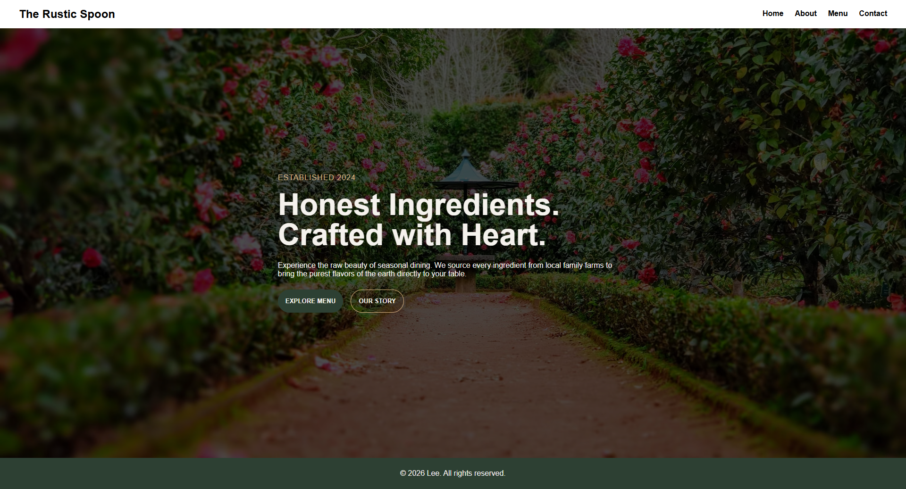

# Restaurant Page

Odin Project that allowed me to practice Webpack and DOM manipulation.

## Live Preview


## Features
- Multi-page restaurant website with Home, About, Menu, and Contact pages
- Tabbed navigation between pages using DOM manipulation
- Responsive design with modern CSS
- Bundled with Webpack

## Setting Up

### Clone the Repo
```bash
git clone https://github.com/LeejanAlipio/restaurant-page.git
cd restaurant-page
```

### Install Dependencies
```bash
npm install
```

### Build and Run
```bash
# Development server
npm run dev

# Production build
npm run build
```

## Project Structure
```
src/
├── index.js           # Entry point, handles navigation
├── index.html         # Main HTML template
├── pages/
│   ├── home.js        # Home page component
│   ├── about.js       # About page component
│   ├── menu.js        # Menu page component
│   └── contact.js     # Contact page component
└── styles/
    ├── root.css       # Global styles and CSS variables
    ├── header.css     # Header navigation styles
    ├── footer.css     # Footer styles
    ├── home.css       # Home page styles
    ├── about.css      # About page styles
    ├── menu.css       # Menu page styles
    └── contact.css    # Contact page styles
```

## Pages
- **Home** - Hero section with restaurant introduction and navigation buttons
- **About** - Restaurant story and mission
- **Menu** - Seasonal dishes with prices
- **Contact** - Location, hours, and contact information